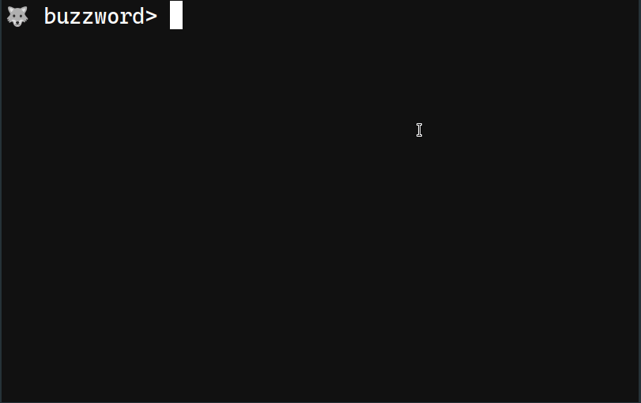

# buzzword

🌈 I am using [React Ink](https://github.com/vadimdemedes/ink)

Every time I read something, I face a huge number of unknown words. I remember last time I saw a webinar about react, I just wrote a list of around 100 keywords to come back to them later. This lead me to think about a tool for keeping these BUZZWORDS. So I built it.



```
// install
npm install -g buzzword

// use
buzzword
```

This is its initial version. I am thinking of adding more neat feature to it. However for now it just solve my problem. I hope it does solve yours too :)

## Todo

<input type='checkbox' disabled /> Add a way for categorizing words. Like when I am listening or reading something about `react` I want to capture its buzzwords in a separate category.  
<input type='checkbox' disabled /> Support something like `npx buzzword add <word>`  
<input type='checkbox' disabled /> Support a way to sync words between multiple devices.
